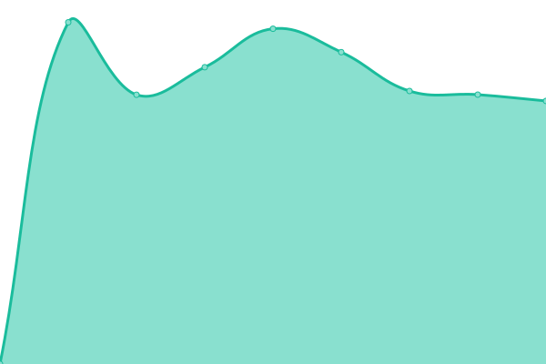

# [📈 Live Status](https://ShadeSoft.github.io/gazmag-status): <!--live status--> **🟩 All systems operational**

This repository contains the open-source uptime monitor and status page for [ShadeSoft](https://shadesoft.dev), powered by [Upptime](https://github.com/upptime/upptime).

With [Upptime](https://upptime.js.org), you can get your own unlimited and free uptime monitor and status page, powered entirely by a GitHub repository. We use [Issues](https://github.com/ShadeSoft/gazmag-status/issues) as incident reports, [Actions](https://github.com/ShadeSoft/gazmag-status/actions) as uptime monitors, and [Pages](https://ShadeSoft.github.io/gazmag-status) for the status page.

<!--start: status pages-->
<!-- This summary is generated by Upptime (https://github.com/upptime/upptime) -->
<!-- Do not edit this manually, your changes will be overwritten -->
<!-- prettier-ignore -->
| URL | Status | History | Response Time | Uptime |
| --- | ------ | ------- | ------------- | ------ |
|  [GazMag](https://gazmag.hu) | 🟩 Up | [gaz-mag.yml](https://github.com/ShadeSoft/gazmag-status/commits/HEAD/history/gaz-mag.yml) | 

 2513ms
     
 | 

<a href="https://status.gazmag.hu/history/gaz-mag">100.00%</a>
    

|  [GazMag (eu)](https://gazmag.eu) | 🟩 Up | [gaz-mag-eu.yml](https://github.com/ShadeSoft/gazmag-status/commits/HEAD/history/gaz-mag-eu.yml) | 

 3748ms
     
 | 

<a href="https://status.gazmag.hu/history/gaz-mag-eu">100.00%</a>
    

|  [GazMag (sk)](https://gazmag.sk) | 🟩 Up | [gaz-mag-sk.yml](https://github.com/ShadeSoft/gazmag-status/commits/HEAD/history/gaz-mag-sk.yml) | 

 2588ms
     
 | 

<a href="https://status.gazmag.hu/history/gaz-mag-sk">100.00%</a>
    

<!--end: status pages-->

[**Visit our status website →**](https://ShadeSoft.github.io/gazmag-status)

## 📄 License

- Powered by: [Upptime](https://github.com/upptime/upptime)
- Code: [MIT](./LICENSE) © [ShadeSoft](https://shadesoft.dev)
- Data in the `./history` directory: [Open Database License](https://opendatacommons.org/licenses/odbl/1-0/)
